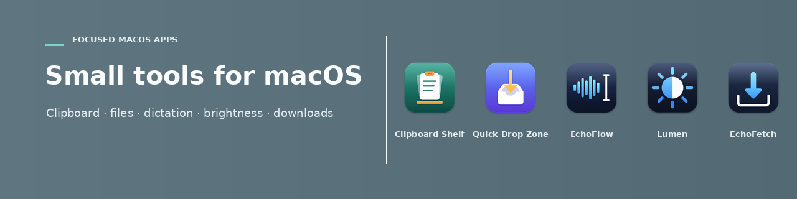

<!-- Profile README for github.com/9phfr6dsw4-dotcom (repo: 9phfr6dsw4-dotcom/9phfr6dsw4-dotcom, file: README.md) -->

  Five focused, native Mac apps for display brightness, downloads, dictation, files, and clipboard history. 
  No accounts. No analytics. Your history and preferences stay on your Mac.

 

<table>
  <tr>
    <td align="center" width="50%" valign="top">
       
      
      <h3><a href="https://github.com/9phfr6dsw4-dotcom/clipboard-shelf">Clipboard Shelf</a></h3>
      
A quiet macOS menu-bar clipboard history with search, pins, and a pause switch.

      
<a href="https://github.com/9phfr6dsw4-dotcom/clipboard-shelf/releases/latest"><b>Download</b></a> · macOS 13+

    </td>
    <td align="center" width="50%" valign="top">
       
      
      <h3><a href="https://github.com/9phfr6dsw4-dotcom/quick-drop-zone">Quick Drop Zone</a></h3>
      
A careful, local-first file organizer in the macOS menu bar.

      
<a href="https://github.com/9phfr6dsw4-dotcom/quick-drop-zone/releases/latest"><b>Download</b></a> · macOS 26+

    </td>
  </tr>
  <tr>
    <td align="center" width="50%" valign="top">
       
      
      <h3><a href="https://github.com/9phfr6dsw4-dotcom/echoflow">EchoFlow</a></h3>
      
Private, on-device dictation for macOS with Apple Speech, Parakeet v3, and Whisper.

      
<a href="https://github.com/9phfr6dsw4-dotcom/echoflow/releases/latest"><b>Download</b></a> · macOS 26+

    </td>
    <td align="center" width="50%" valign="top">
       
      
      <h3><a href="https://github.com/9phfr6dsw4-dotcom/Lumen">Lumen</a></h3>
      
Brightness, contrast and volume for every display, from the menu bar or your keyboard.

      
<a href="https://github.com/9phfr6dsw4-dotcom/Lumen/releases/latest"><b>Download</b></a> · macOS 26+

    </td>
  </tr>
  <tr>
    <td align="center" colspan="2" valign="top">
       
      
      <h3><a href="https://github.com/9phfr6dsw4-dotcom/EchoFetch">EchoFetch</a></h3>
      
Save videos and audio from YouTube and other sites, straight from a copied link.

      
<a href="https://github.com/9phfr6dsw4-dotcom/EchoFetch/releases/latest"><b>Download</b></a> · macOS 26+

    </td>
  </tr>
</table>

Built in Swift, native to macOS · Free downloads from each app's Releases page

